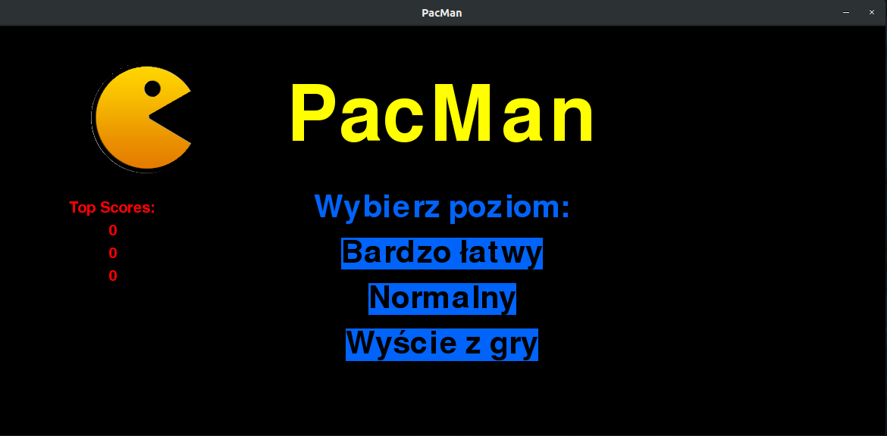
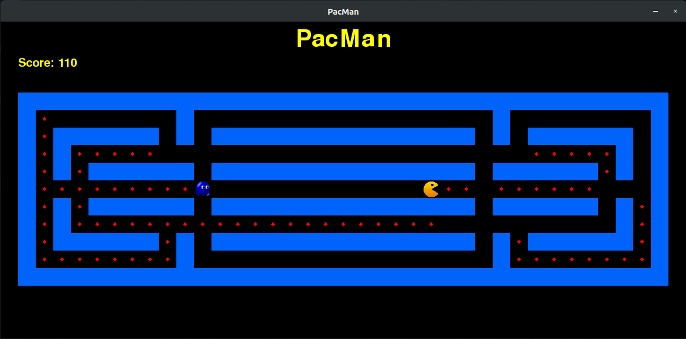

## Table of contents
* [General info](#general-info)
* [Technologies](#technologies)
* [Setup](#setup)
* [License](#license)

## General info
Project was developed for Introduction for Computer Science class (AGH UST).




## Technologies
Project is created with:
* Python version: 3.6
* Pygame version: 1.9

## Setup
To run this project:
```
$ python3 main.py
```

## License
This project is released under the MIT Licence. See the bundled LICENSE file for details.
